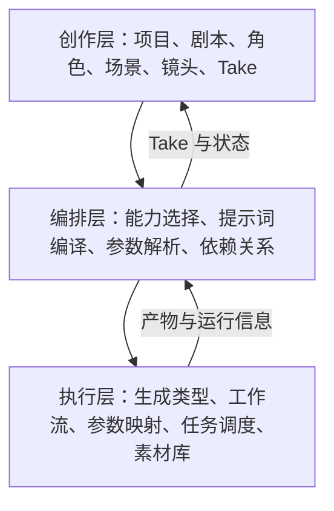

# ComfyUI Console AI 短剧产品设计规划

> 规划日期：2026-08-14
> 产品方向：从“ComfyUI 工作流控制台”升级为“项目制 AI 短剧生产工作台”
> 适用版本：V2.1 起逐步实施

## 1. 产品重新定位

现有系统已经具备工作流配置、图片/视频/音频生成、任务调度、素材管理等基础能力，但这些能力仍然以“生成一次内容”为中心。短剧生产的真正困难并不是能否生成一张图或一段视频，而是如何把一个创意稳定地转化为一组角色一致、情节连续、可反复修改并最终能够合成的镜头。

新产品定位为：

> 用户描述自己想要的短剧，系统以编剧、导演、美术、制片和剪辑助手的方式，将创意组织为可控制的生产项目；ComfyUI 负责执行底层生成任务。

产品的一级对象应从“任务”改为“短剧项目”。任务、工作流和节点参数仍然保留，但退到执行层，不再成为普通创作者首先面对的内容。

### 1.1 核心价值

1. 降低创作门槛：用户可以从一句话、故事梗概、完整剧本或小说开始。
2. 管理连续性：统一维护角色、服装、场景、道具、画风、声音和时间线。
3. 让生产可控制：每一步均可确认、修改、重做和回退，而不是黑盒式“一键成片”。
4. 提高批量效率：从分镜批量建立任务，自动选择能力和填充参数。
5. 保留专业入口：高级用户仍可选择具体工作流、参数方案和节点映射。
6. 形成生产闭环：创意、剧本、分镜、生成、配音、剪辑、审核和导出均属于同一个项目。

## 2. 设计原则

### 2.1 项目优先，而不是任务优先

用户首先看到项目进度、当前集、待制作镜头和阻塞项。任务管理是生产监控工具，不是创作入口。

### 2.2 意图优先，而不是参数优先

用户填写“人物做什么、情绪如何、镜头怎么拍、持续几秒”，系统把这些意图编译为提示词、参考素材和工作流参数。工作流节点参数默认隐藏在高级设置中。

### 2.3 先锁定设定，再批量生产

角色、场景和整体视觉风格未经确认时，不建议大批量生成镜头。系统通过阶段检查减少后期返工。

### 2.4 AI 只提出方案，不静默覆盖

剧本改写、角色设定、分镜拆解和镜头修复均以“建议/差异”的形式呈现，用户可以接受、拒绝或局部修改。每次重要修改形成版本。

### 2.5 渐进式专业化

- 新手模式：向导、模板、少量关键选择和智能默认值。
- 标准模式：完整镜头卡、批量生成和多版本比较。
- 专业模式：工作流、参数方案、种子、节点映射和运行日志。

### 2.6 桌面负责生产，移动端负责审核

桌面端支持剧本、分镜、批量生产和时间线；移动端优先支持查看进度、预览、批注、批准版本和少量修改，不强行缩放复杂编辑器。

## 3. 端到端创作流程


每个阶段都有明确的输入、产物、确认状态和进入下一阶段的条件。允许跳过阶段，但系统应提示可能的风险。

### 3.1 新建短剧

支持四种起点：

1. 一句话创意：通过问答补足人物、冲突和结局方向。
2. 故事梗概或大纲：AI 辅助拆分分集和情节节拍。
3. 完整剧本：解析场景、人物、对白和动作。
4. 小说/文档导入：复用 Novel2Script 的解析、故事圣经和改编能力。

首次创建只询问决定全局结果的内容：

- 剧名、类型、目标受众和内容基调；
- 横屏/竖屏、平台、单集时长和预计集数；
- 真人、动画、写实、国风等视觉方向；
- 质量档位：草稿、标准、成片；
- 可用算力、期望制作周期和可选预算上限。

创建后生成《创作简报》，所有后续 AI 助手都以此为共同约束。

### 3.2 剧本创作

V2.1 的 Novel2Script 合并应成为短剧的前期创作引擎，而不是孤立的文档工具。主要能力包括：

- 小说章节解析、人物/地点/事件抽取；
- 分集建议、场景拆分和对白归属；
- 适配短剧节奏的改编方案；
- 三幕结构、冲突密度、悬念和结尾钩子检查；
- 原文与改编剧本对照、版本树和回退；
- 将确认后的场景直接转换为分镜草稿。

剧本编辑器需要同时支持结构视图和正文视图。结构视图用于拖动分集、场景和节拍；正文视图用于编辑动作、对白、旁白和转场。

### 3.3 角色与世界设定

为每个项目建立唯一可信的“设定圣经”：

- 角色：身份、年龄感、外形、体态、性格、关系、禁用特征；
- 角色造型：基础形象、不同服装、发型、妆容和年龄阶段；
- 场景：空间布局、时间、天气、光线、色彩和固定物件；
- 道具：外观、归属、出现集数和连续性要求；
- 视觉风格：画风、镜头语言、色板、构图、负面约束；
- 声音设定：角色音色、语速、口音、情绪范围和背景声音风格。

角色确认流程建议为“文字设定 → 候选形象 → 标准设定图 → 多角度/表情/服装测试 → 锁定”。锁定后，后续镜头默认引用角色 ID、参考图、LoRA 或其他一致性方案，不重复让用户选择。

### 3.4 分镜设计

系统根据剧本场景提出镜头拆解，但用户控制最终镜头。每张镜头卡至少包含：

- 所属集、场景、镜头编号和预计时长；
- 叙事目的和情绪目标；
- 出场角色、服装、场景、道具；
- 动作、表情、对白或旁白；
- 景别、机位、镜头运动、构图和转场；
- 起始帧、结束帧、姿态或参考视频等素材；
- 画面比例、质量档位和生成能力要求；
- 连续性约束以及不可改变项。

提供三种视图：

- 卡片视图：适合查看画面和编辑单镜头；
- 表格视图：适合批量修改时长、场景、状态和负责人；
- 时间线/故事板视图：适合检查节奏和镜头衔接。

分镜图可以先用低成本工作流批量生成。用户确认构图后，再进入视频生产，避免直接生成昂贵视频。

### 3.5 镜头生产

镜头生产页采用看板与镜头列表组合，状态建议为：

`草稿 → 待准备 → 可生成 → 排队中 → 生成中 → 待审核 → 已通过 / 需返工`

一个镜头允许有多个 Take。每个 Take 保存生成参数、工作流版本、引用素材、运行日志和产物。用户可并排比较、设为采用版本、添加意见或以其为基础继续生成。

常用操作包括：

- 批量生成分镜草稿或正式镜头；
- 只修改一个变量后重做，例如表情、运镜或时长；
- 锁定角色/场景/构图后重做其余部分；
- 失败重试和从中断点恢复；
- 将满意结果设为下一镜头的首帧或参考；
- 从任务结果自动建立 Take 并归档到项目素材。

### 3.6 声音制作

声音工作台围绕对白表，而不是单独的音频生成表单：

- 从剧本自动提取对白、旁白和角色；
- 为角色绑定声音档案；
- 按句设置情绪、语速、停顿、重音和发音纠正；
- 批量试听、重做、替换和锁定；
- 管理环境音、音效和背景音乐；
- 将对白与镜头关联，为后续口型同步提供输入；
- 自动生成字幕时间码，并允许人工校正。

### 3.7 剪辑与成片

首期不需要复刻专业 NLE，但需要提供完成短剧所需的轻量时间线：

- 按已确认分镜自动排列视频；
- 视频、对白、音效、音乐和字幕多轨展示；
- 裁切头尾、调整顺序、基础转场、音量和淡入淡出；
- 缺失镜头和时长冲突提示；
- 预览单场、单集和全片；
- 按平台预设导出分辨率、帧率、编码和字幕形式。

后续可增加 EDL/XML 等工程导出，与专业剪辑软件衔接。

## 4. 产品信息架构

### 4.1 全局菜单

```text
系统概览

短剧项目
├─ 全部项目
├─ 新建短剧
└─ 项目模板

生产中心
├─ 制作看板
├─ 任务管理
└─ 批次任务

资产中心
├─ 项目素材
├─ 全局素材库
├─ 提示词与风格库
└─ 回收站

能力中心
├─ 生成类型配置
├─ 工作流管理
└─ 参数方案

系统配置
├─ AI 服务配置
├─ 运行监控
├─ 用户与权限
├─ 系统设置
└─ 审计日志
```

图片生成、视频生成和音频生成不再占用主要一级菜单，但保留“独立创作”快捷入口，满足非项目型生成需求。

### 4.2 项目内工作台

进入项目后采用固定的项目导航：

```text
项目概览 | 创作简报 | 剧本 | 角色与世界 | 分镜 | 镜头生产 | 声音 | 剪辑 | 审核与导出
```

项目概览显示：总进度、各集状态、待确认事项、失败/阻塞任务、最新 Take、预计生成量和快捷入口。用户再次进入项目时返回最近编辑位置，而不是跳回全局首页。

## 5. 关键界面设计

### 5.1 项目首页

- 顶部：项目封面、剧名、规格、当前阶段、最近保存时间；
- 左侧：分集列表与完成比例；
- 中部：阶段进度漏斗和“下一步建议”；
- 右侧：阻塞项、待审核镜头、算力与任务状态；
- 下方：最近素材、最近版本、生产统计。

首页只呈现需要决策的信息，避免变成监控数据堆积页。

### 5.2 分镜工作台

桌面端使用三栏布局：左侧分集/场景树，中部镜头卡或故事板，右侧镜头属性。打开属性后仍应保留足够的画面预览空间。移动端改为场景列表、镜头卡和底部抽屉编辑。

### 5.3 镜头审核器

支持多 Take 并排比较、逐帧预览、画面放大缩小和拖动、视频播放、参数溯源、批注和采用。审核意见应结构化为“人物、动作、构图、连续性、画质、声音、其他”，以便一键转换为重做要求。

### 5.4 制作看板

看板以镜头为单位，任务只是镜头卡的运行状态。卡片显示预览、集/场/镜号、角色、时长、Take 数、状态和阻塞原因。支持按项目、集、场景、状态、角色和日期过滤。

## 6. AI 协作角色

系统不应只有一个泛化的“AI 生成”按钮，而应按工作目标提供助手：

| 助手 | 主要职责 | 输出 |
| --- | --- | --- |
| 编剧助手 | 补全创意、分集、改编、对白和节奏诊断 | 剧本建议或新版本 |
| 导演助手 | 场面调度、镜头拆解、景别和运镜建议 | 分镜方案 |
| 美术设定助手 | 角色、场景、道具、色板和风格统一 | 设定卡与生成草稿 |
| 制片助手 | 依赖检查、算力估算、批次安排和阻塞提示 | 制作计划 |
| 连贯性检查员 | 检查服装、道具、时间、方向、角色和对白连续性 | 问题清单 |
| 声音助手 | 配音建议、情绪、音效、音乐和字幕 | 声音制作方案 |
| 剪辑助手 | 节奏、镜头顺序、缺失镜头和时长建议 | 时间线修改建议 |

所有助手统一遵循创作简报和设定圣经，并通过可审阅的变更集工作。

## 7. 与现有 ComfyUI 能力的衔接

### 7.1 三层结构



现有生成类型配置不是被替换，而是升级为“能力实现”。例如一个工作流可声明：支持图生视频、首尾帧、人物参考、姿态控制、口型同步、最长时长、分辨率范围及资源消耗等级。

### 7.2 镜头到任务的转换

1. 用户确认镜头意图和引用素材。
2. 系统根据镜头需求匹配可用生成能力。
3. 提示词编译器组合剧本信息、角色锁定项、场景、镜头语言和负面约束。
4. 参数解析器将时长、尺寸、种子和素材绑定到工作流映射。
5. 生成现有任务草稿，经用户确认或批量提交。
6. 调度器执行任务；结果进入素材库，同时创建对应镜头的 Take。
7. 用户审核 Take，通过或形成结构化返工要求。

普通用户只选择“草稿/标准/成片”和创作意图；高级用户可以覆盖工作流及参数。

### 7.3 工作流能力注册建议

每个绑定工作流补充结构化能力标签：

- 输入模态：文本、图片、视频、音频、首帧、尾帧、多参考图；
- 输出模态：图片、视频、音频、字幕；
- 生产用途：角色设定、场景设定、分镜、图生视频、动作迁移、人物替换、口型同步等；
- 约束：尺寸、时长、帧率、最大引用数；
- 一致性能力：角色、姿态、场景、风格；
- 成本等级、速度等级、推荐质量阶段；
- 工作流版本与兼容状态。

## 8. 领域数据模型

新增创作领域模型，不直接把短剧结构塞入现有 Task 表：

| 对象 | 用途 |
| --- | --- |
| `ShortDramaProject` | 项目根对象、规格、阶段和归属 |
| `ProjectBrief` | 创作目标、受众、风格和全局约束 |
| `Episode` | 分集、目标时长、梗概和状态 |
| `Scene` | 时间地点、出场角色、剧情内容和连续性 |
| `Shot` | 镜头意图、画面、声音、时长和生产状态 |
| `Take` | 某镜头的一次候选结果及完整溯源 |
| `Character` / `CharacterVariant` | 角色及服装、年龄等造型版本 |
| `Location` / `Prop` | 场景、道具和引用资源 |
| `StyleBible` | 视觉、镜头、色彩和负面规则 |
| `VoiceProfile` / `DialogueLine` | 声音档案和对白 |
| `Timeline` / `Track` / `Clip` | 成片编排 |
| `ContinuityConstraint` | 跨镜头一致性约束 |
| `ReviewIssue` | 审核问题、定位和返工状态 |
| `CreativeJob` | LLM/解析等非 ComfyUI 后台作业 |
| `ShotTaskLink` | Shot/Take 与现有 Task 的关联 |

现有 Resource 继续作为文件与元数据的统一载体。资源需要支持项目、集、场景、镜头、Take、角色和用途等关联，而不是只依赖文件夹表达业务关系。

## 9. 自动化与质量控制

### 9.1 生产前检查

- 镜头中的角色是否有已锁定形象；
- 场景和服装是否明确；
- 所需工作流是否在线且映射完整；
- 输入素材是否存在且可访问；
- 时长、尺寸和模型约束是否冲突；
- 前置镜头或首帧是否已经确认。

### 9.2 生成后检查

- 文件可读取、尺寸/时长/帧率符合要求；
- 人物数量、主体和画幅是否明显异常；
- 当前镜头与相邻镜头的服装、道具和场景是否冲突；
- 对白长度是否超过镜头时长；
- 是否缺失声音、字幕或必要的转场素材。

自动检查只标记风险，不应未经用户同意删除或替换产物。

### 9.3 成本与时间控制

制作计划应显示预计镜头数、图片/视频/音频生成量、可并发数和粗略完成时间。批量执行前显示估算；用户可以先生成低成本分镜或抽样镜头，确认后再生产全量成片。

## 10. 模板体系

模板不只是提示词，而是一套可复用的生产方案：

- 项目模板：竖屏情感短剧、悬疑反转、动画短剧、产品剧情等；
- 剧本模板：集长、节拍密度、开场钩子和结尾钩子；
- 视觉模板：风格圣经、色板、镜头语言和默认比例；
- 角色模板：设定字段和一致性测试流程；
- 分镜模板：常用对话、追逐、动作、转场镜头组合；
- 生产模板：能力选择、质量档位、工作流链和导出规格。

模板应用后形成项目副本，不与系统模板强绑定，用户可继续修改。

## 11. 分版本开发规划

### V2.1：短剧前期创作与项目骨架

目标：让用户可以从创意/小说建立短剧项目，并生成可进入生产的剧本和镜头清单。

- 建立 Project、Episode、Scene、Shot、Take 基础模型；
- 合并 Novel2Script：导入、故事圣经、剧本工作台、质量报告、版本；
- 新建短剧向导和项目概览；
- 角色、场景、道具的基础设定卡；
- 剧本场景转为可编辑的镜头卡；
- 镜头一键建立现有生成任务草稿；
- 任务结果回写为 Take，并进入项目素材；
- 保持现有 V2 独立生成、任务、素材和工作流功能不变。

V2.1 不承诺自动成片、复杂时间线或全自动连续性识别。

### V2.2：分镜与镜头生产

目标：完成从设定锁定到批量镜头审核的核心生产闭环。

- 角色标准设定图及造型版本；
- 分镜卡片/表格/故事板视图；
- 工作流能力注册和智能匹配；
- 提示词编译器与参数自动装配；
- 镜头生产看板、依赖检查和批量执行；
- 多 Take 比较、采用、批注和定向重做；
- 基础连续性规则与相邻镜头检查。

### V2.3：声音、字幕与轻量剪辑

目标：在系统内形成可预览和可导出的完整单集。

- 对白表、角色声音档案和批量配音；
- 环境音、音效和 BGM 管理；
- 口型同步工作流衔接；
- 字幕生成和校正；
- 多轨轻量时间线；
- 单集预览、技术质检和平台预设导出。

### V2.4：智能制片与团队协作

目标：降低大批量、多集项目的管理成本。

- AI 制片排程、算力/耗时估算和自动批次；
- 更完整的视觉与叙事连续性分析；
- 跨集素材复用和项目模板市场；
- 批注、审核流、角色权限和交付状态；
- 专业剪辑工程导出；
- 可控的工作流链编排和自动修复建议。

## 12. V2.1 推荐开发顺序

1. 固化当前 V2 回归基线，明确新旧路由和功能开关。
2. 建立短剧领域表、API 权限、版本和资源关联。
3. 完成项目列表、新建向导、项目概览和项目内导航。
4. 接入 Novel2Script 的导入、解析、故事圣经和剧本版本。
5. 完成角色/场景设定卡以及项目素材关联。
6. 完成 Scene → Shot 的拆解、人工编辑和顺序维护。
7. 完成 Shot → Task 草稿以及 Task Result → Take 的双向桥接。
8. 完成项目进度、失败恢复、审计、响应式界面和回归测试。

每一步都应形成可独立验收的纵向切片，避免先建完所有表再长期等待页面可用。

## 13. 验收指标

### 13.1 V2.1 产品验收

- 新用户可在 15 分钟内从一句话或文档得到首版分集与镜头清单；
- 剧本、角色、场景、镜头、任务和生成结果之间均可追溯；
- 从已确认镜头创建生成任务不超过 3 次主要操作；
- 至少 90% 的常规参数由镜头和项目规格自动填充；
- 生成成功后自动建立 Take，无需用户到素材库手工查找文件；
- 页面刷新或重新登录后可恢复项目位置和未提交草稿；
- V2 现有独立生成及管理功能回归通过。

### 13.2 后续业务指标

- 首版分镜采纳率；
- 角色设定锁定后的镜头一次通过率；
- 单镜头平均 Take 数和返工原因分布；
- 从剧本确认到首版单集的耗时；
- 工作流自动匹配成功率和任务失败恢复率；
- 项目完片率，而不仅是任务完成数。

## 14. 范围控制与主要风险

1. 不把“一键生成完整短剧”作为 V2.1 承诺。先完成可控闭环，再提高自动化程度。
2. 不在第一期开发完整专业剪辑器；优先支持预览、排列、基础音轨和导出。
3. 创作模型与执行任务必须分离，否则任务分页、删除或重试会破坏项目结构。
4. 角色一致性不能只依赖提示词，需要参考资产、模型能力和人工锁定共同完成。
5. 工作流差异很大，必须先建立能力声明和映射校验，不能靠名称猜测所有参数。
6. 长耗时 AI/ComfyUI 操作必须后台执行，项目编辑页面不得因排队任务阻塞或自动刷新丢失数据。
7. 项目编辑应提供自动保存、本地草稿、冲突提示和恢复机制。

## 15. 最终产品体验

理想状态不是用户点击一次按钮等待成片，而是系统随时清楚地回答四个问题：

1. 这部短剧现在讲的是什么，创作目标是否一致？
2. 当前缺少哪些设定、镜头或声音，下一步应该做什么？
3. 每个生成结果来自哪个镜头、哪些参考和哪套工作流，能否准确重做？
4. 哪些内容已经确认，哪些仍待审核，距离可交付成片还有多远？

当这四个问题在项目工作台中始终清晰，现有 ComfyUI 能力才真正从“生成工具”升级为“AI 短剧生产系统”。
