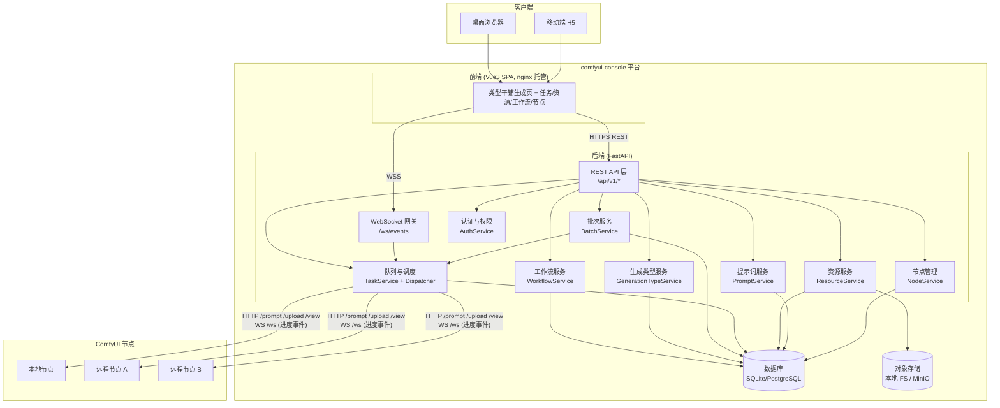
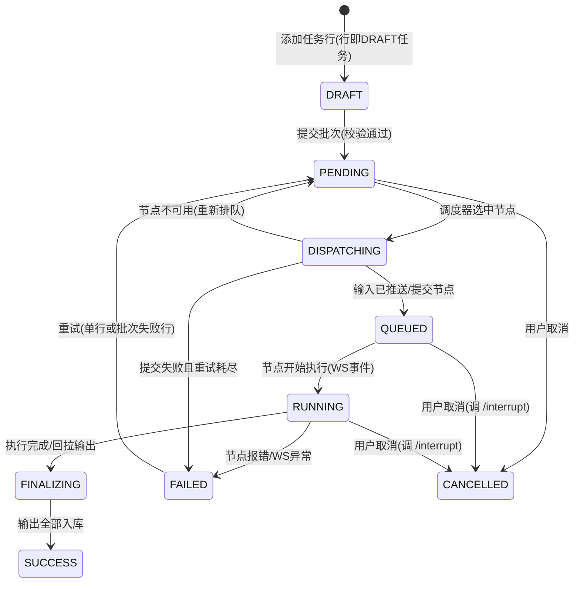
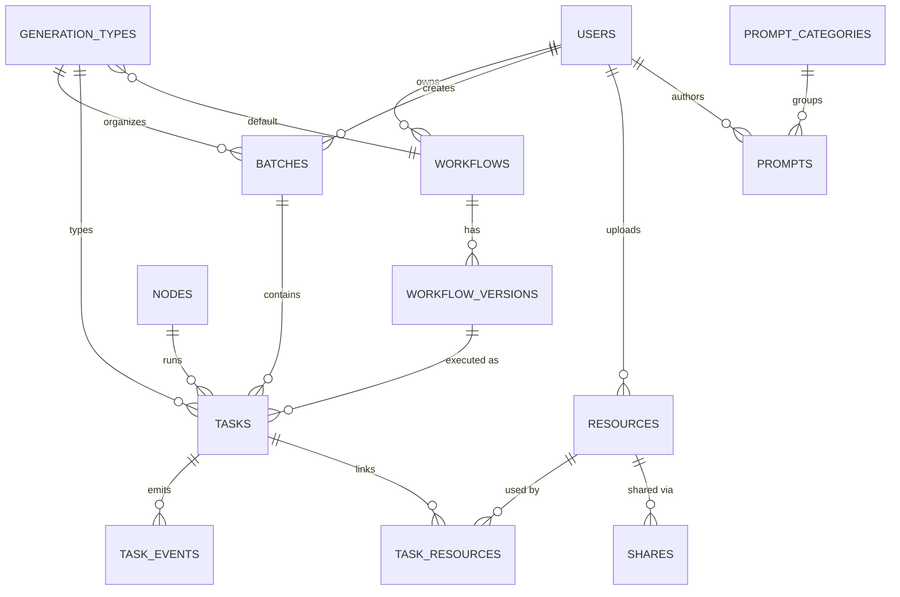

# comfyui-console 架构设计文档

> 版本：v0.2　日期：2026-08-05　状态：待评审
> 配套文档：[功能清单 v0.2](feature-list.md)、[功能详细规格 v0.3](feature-specification.md)、[现有系统分析](reference/existing-system-analysis.md)

## 0. v0.1 → v0.2 变更记录

1. 新增**批次（Batch）批量任务模型**：批次/任务行成为任务组织的基本单位，吸收现有系统的批量任务行交互。
2. 新增**提示词库**模块（Prompt + 分类），发布任务时可检索选用。
3. 新增**生成类型（GenerationType）**概念：图片/视频/音频三大类下可扩展类型，类型绑定默认工作流与参数模板；生成页面**配置驱动**，新增类型无需开发新页面。
4. 菜单结构按现有系统方式平铺：图片生成、视频生成、音频生成各自独立菜单组（音频为新增组）。
5. ParamSchema 扩展视频/音频资源槽位与单位元数据（明确"时长(秒)/帧数/帧率"）。
6. 资源删除改为**软删除 + 回收站**；新增**审计日志**与**平台设置**表。
7. 数据模型与 API 全面更新（见第 9、10 章）。

## 1. 项目概述

comfyui-console 是一个面向本地或远程 ComfyUI 实例的统一管理平台，核心能力：

1. **工作流管理** —— 集中存储、版本化 ComfyUI 工作流，按生成类型分类并参数化发布。
2. **批量任务与排队管理** —— 以批次（任务行表格）为核心交互组织生产任务；平台级队列统一调度到一个或多个 ComfyUI 节点执行，全程跟踪状态。
3. **输入输出资源统一管理与同步共享** —— 任务输入（图片/视频/音频/参数）与输出统一入库、去重、跨端同步，支持分享。
4. **移动端支持** —— 响应式 H5，移动端可发布任务、查看进度与结果。

### 1.1 设计原则

- **节点无关**：ComfyUI 实例只需暴露原生 HTTP/WebSocket API 即可接入，节点零改造。
- **平台级队列**：任务先入平台队列再调度分发，支持多节点负载均衡、优先级、重试。
- **配置驱动生成页**：所有生成类型页面是同一「批量任务表格」视图的实例化，类型 = 分类 + 默认工作流 + 参数模板。
- **资源一等公民**：文件由平台统一接管，不依赖节点本地文件系统。
- **移动优先**：发布与结果查看在移动端完整闭环。
- **渐进式架构**：MVP 最小依赖（SQLite + 本地存储 + asyncio），队列/存储/数据库接口化，可升级 Redis、MinIO/S3、PostgreSQL。

### 1.2 技术选型

| 层 | 选型 |
| --- | --- |
| 后端 | Python 3.11+ / FastAPI |
| ORM / 迁移 | SQLAlchemy 2.x + Alembic |
| 数据库 | SQLite（MVP）→ PostgreSQL（生产） |
| 任务队列 | DB 队列 + asyncio 调度器（MVP）→ Redis Streams（扩展） |
| 对象存储 | 本地文件系统（MVP）→ MinIO / S3（扩展） |
| ComfyUI 通信 | httpx + websockets，调用节点原生 API |
| 前端 | Vue 3 + Vite + TypeScript + Pinia + Vue Router |
| UI | Naive UI + Tailwind CSS（移动优先响应式） |
| 实时推送 | 原生 WebSocket |
| 部署 | Docker Compose |

## 2. 总体架构



### 2.1 核心链路：批次执行流

1. 用户在某生成类型页编辑任务行（或 CSV/Excel 导入）→ `POST /api/v1/batches` 建批次，任务行以 `DRAFT` 状态的 Task 逐行持久化（`/batches/{id}/rows`），草稿与模板均可保存复用。
2. 提交批次 `POST /batches/{id}/submit`：逐行校验并转 `PENDING`；行级类型决定使用的工作流版本（行类型默认工作流或批次指定工作流）。
3. Dispatcher 按优先级与节点策略领取 Task → 推送输入资源到节点（`/upload/image` 等）→ ParamSchema 注入参数 → `POST /prompt`。
4. 节点 `/ws` 事件驱动任务状态机；完成后 `/history` + `/view` 回拉输出入库。
5. 批次状态由任务行状态聚合（成功数/失败数/进度）；全程 WS 推送各端。

## 3. 核心领域概念

| 概念 | 说明 |
| --- | --- |
| **GenerationType（生成类型）** | 生产能力的分类单元：`media_type`（image/video/audio）+ `code`（t2i/i2i/t2v/tts…）+ 默认工作流 + 参数模板 + 菜单排序。内置图片 5 类、视频 5 类、音频 3 类，可自定义扩展。 |
| **Workflow（工作流）** | ComfyUI 工作流定义：UI JSON + API JSON + ParamSchema + 输出节点映射；版本化，任务绑定版本可复现。 |
| **ParamSchema（参数模式）** | 工作流可变参数声明：节点 ID + 字段路径 + 类型 + 单位/约束。v0.2 类型：`text/textarea/int/float/bool/select/seed/image/video/audio`，并支持 `unit`（px/秒/帧/fps）元数据。 |
| **Batch（批次）** | 一次批量生产的组织单位：名称、生成类型、全局参数（全局提示词 1/2、默认尺寸/种子等）、任务行集合、来源（手工/导入/模板）。可保存为模板复用。 |
| **Task（任务）** | 批次中的一行 = 一个执行任务：行号、（混合批次时的）行级生成类型、参数快照、输入资源、目标节点、prompt_id、状态机、重试与结果。单任务发布视为只有一行的批次。 |
| **Node（节点）** | 注册的 ComfyUI 实例：base_url/ws_url、能力标签、并发上限、状态。 |
| **Resource（资源）** | 统一管理的文件对象：media_type(image/video/audio)、direction(input/output)、hash、尺寸/时长元数据、可见性、软删除标记。 |
| **Prompt（提示词）** | 提示词库条目：名称、正文、负面提示词、分类、标签、备注、封面。 |
| **Share（分享）** | 资源/任务结果的令牌链接：过期时间、密码、下载权限、可撤销。 |
| **Event（事件）** | 任务状态迁移与进度记录，WS 推送与审计的数据源。 |
| **AuditLog（审计日志）** | 敏感操作流水：人、动作、对象、明细、IP、时间。 |

### 3.1 任务与批次状态机



批次状态为聚合视图，不落库为独立状态机：`DRAFT`（未提交）、`SUBMITTING`（提交中，后台逐行转 PENDING）、`RUNNING`（存在未完结行）、`SUCCESS`（全部行成功）、`PARTIAL`（部分成功）、`FAILED`（全部失败）、`CANCELLED`。

## 4. 后端设计

### 4.1 模块结构

```text
backend/
├── app/
│   ├── main.py                  # FastAPI 入口、中间件、路由挂载
│   ├── config.py                # pydantic-settings，环境变量驱动
│   ├── api/v1/                  # REST 路由（薄层）
│   │   ├── auth.py  users.py  generation_types.py  workflows.py
│   │   ├── batches.py  tasks.py  prompts.py  nodes.py
│   │   ├── resources.py  shares.py  settings.py  audit_logs.py
│   ├── ws/gateway.py            # /ws/events 客户端网关
│   ├── core/
│   │   ├── security.py          # JWT、密码哈希、权限装饰器
│   │   ├── events.py            # 事件总线（内存 pub/sub，可升 Redis）
│   │   ├── audit.py             # 审计日志写入
│   │   └── exceptions.py        # 统一错误码与中文提示
│   ├── models/                  # SQLAlchemy ORM
│   ├── schemas/                 # Pydantic 模型
│   ├── services/
│   │   ├── workflow_service.py        # 工作流 CRUD/版本/ParamSchema 抽取/测试执行
│   │   ├── generation_type_service.py # 类型 CRUD、默认工作流、菜单输出
│   │   ├── batch_service.py           # 批次编辑/导入/模板/提交/取消/重试失败行
│   │   ├── task_service.py            # 任务查询/取消/重试/事件
│   │   ├── prompt_service.py          # 提示词与分类
│   │   ├── resource_service.py        # 入库/读取/回收站/抽帧
│   │   ├── share_service.py           # 分享令牌与访问控制
│   │   ├── node_service.py            # 节点注册/健康/能力采集
│   │   └── auth_service.py
│   ├── comfy/
│   │   ├── client.py            # ComfyUIClient：单节点 HTTP+WS 封装
│   │   ├── prompt_builder.py    # ParamSchema 注入 → API prompt
│   │   └── formats.py           # UI/API JSON 校验与转换辅助
│   ├── queue/
│   │   ├── base.py              # QueueProvider 抽象
│   │   ├── db_queue.py          # MVP：DB 队列
│   │   └── dispatcher.py        # 调度循环
│   ├── storage/
│   │   ├── base.py              # StorageProvider 抽象
│   │   └── local_fs.py          # 本地 FS（扩展：minio.py）
│   └── db.py
├── alembic/
├── tests/
└── pyproject.toml
```

### 4.2 ComfyUI 集成（comfy 包）

平台通过 ComfyUI 原生 API 与节点交互，节点零改造：

| 用途 | ComfyUI API | 调用时机 |
| --- | --- | --- |
| 提交任务 | `POST /prompt` → `prompt_id` | Dispatcher 派发时 |
| 上传输入 | `POST /upload/image`（multipart） | 派发前推送输入资源 |
| 进度/完成事件 | `WS /ws?clientId=...` | 节点常驻监听 |
| 输出清单 | `GET /history/{prompt_id}` | executed 事件后 |
| 拉取输出 | `GET /view?filename=..&type=output` | 输出回收 |
| 状态/队列 | `GET /system_stats` `GET /queue` | 健康检查、负载评估 |
| 节点定义 | `GET /object_info` | 注册时采集能力标签 |
| 中断 | `POST /interrupt`、`POST /queue {"delete": [...]}` | 取消任务 |

设计要点：每节点一个 ComfyUIClient（httpx AsyncClient + WS 长连接，断线自动重连）；重连后 `/history` 对在途任务对账防丢完成事件；提交时使用平台生成的 `client_id`，事件按 `prompt_id` 路由到 Task；节点 WS 消息归一化为 `TaskEvent{task_id, type, progress, payload}` 进入事件总线。工作流双格式都存：UI JSON 用于画布互通，API JSON 用于执行，参数注入只作用于 API JSON。

### 4.3 ParamSchema v0.2 与 prompt 构建

```json
{
  "params": [
    {"key": "prompt",  "node": "6",  "path": "inputs.text",   "type": "textarea", "label": "正向提示词"},
    {"key": "seed",    "node": "3",  "path": "inputs.seed",   "type": "seed",     "label": "随机种子"},
    {"key": "width",   "node": "5",  "path": "inputs.width",  "type": "int",      "label": "宽度",  "unit": "px", "default": 720},
    {"key": "length",  "node": "8",  "path": "inputs.length", "type": "int",      "label": "帧数",  "unit": "帧", "default": 81},
    {"key": "ref_img", "node": "10", "path": "inputs.image",  "type": "image",    "label": "参考图"},
    {"key": "ref_aud", "node": "12", "path": "inputs.audio",  "type": "audio",    "label": "参考音频"}
  ]
}
```

与 v0.1 的差异：`image/video/audio` 三类资源槽位统一走"平台资源 ID → 读对象存储 → 上传到目标节点 → 回填文件名"流程；`unit` 元数据用于前端展示（解决现有系统"时长/帧数"含义混淆问题）；`seed` 类型内置随机化。全局提示词 1/2 与行提示词的拼接规则定义在生成类型的参数模板中（如 `{global1}\n{row}\n{global2}`），提交时由 prompt_builder 计算最终文本并存入任务参数快照，页面可预览。

### 4.4 批次执行引擎（BatchService + Dispatcher）

**提交批次：** 逐行校验（必填参数、资源存在且格式合法、行级类型有可用工作流）→ 校验失败的行保持 `DRAFT` 并写入错误原因，不阻塞其他行 → 有效行 `DRAFT → PENDING`（记录参数快照）→ 批次进入 `RUNNING` 聚合态。

**混合批次路由：** 任务行携带行级 `generation_type_id` 时，用该类型默认工作流版本执行；否则用批次工作流。类型未配置默认工作流的行校验失败并提示管理员配置。

**队列与调度（沿用 v0.1，DB 队列 MVP）：** 任务表即队列表；Dispatcher 按优先级 + 批次提交顺序 + 行号领取；节点选择 = 标签过滤 + 加权打分（空闲并发、健康度、在途数）；节点级 `max_concurrent` 硬限流；失败按 `max_retries` 重试，节点掉线在途任务标记可手动重试；`QueueProvider` 抽象保留 Redis 升级位。

**完成回收：** executed/execution_error → `/history` → `/view` 拉取 → 入库（去重、缩略图/封面、元数据）→ Task `SUCCESS` → 事件广播。批次进度 = 行状态聚合。

## 5. 前端设计（Vue3 + 响应式 H5）

### 5.1 菜单与路由

菜单结构以功能清单附二为准：素材库首页；图片生成（5 子页）、视频生成（5 子页）、音频生成（3 子页）三个平铺菜单组；任务管理（执行看板/完成记录/操作记录）；资源库；工作流；提示词库；节点管理；系统设置。**生成组菜单由后端 `GET /api/v1/generation-types` 动态输出**（按 media_type 分组、menu_order 排序、enabled 过滤），新增类型配置后自动出现。

### 5.2 配置驱动的生成页

```text
GenerationPage.vue（唯一页面组件，按路由 code 加载类型配置）
├── TypeHeader        # 类型名、默认工作流选择/切换、工作流信息
├── GlobalParams      # 全局提示词 1/2、默认尺寸/时长/种子等（模板定义）
├── BatchGrid         # 批量任务行：桌面=表格，移动端=行卡片
│   ├── RowCells      # 由 ParamSchema + 类型模板渲染（文本/数字/滑块/资源槽位）
│   └── RowActions    # 复制/删除/逐行生成/预览
├── ImportDialog      # CSV/Excel 导入：起始行/列、追加或清空、列映射、匹配结果预览
├── SaveDialog        # 保存批次/批次模板
└── SubmitBar         # 批量生成（无行禁用）、取消批次、重试失败行
```

复用组件：`ParamForm`（ParamSchema→表单）、`ResourceSlot`（图片/视频/音频槽位：上传/资源库选择/拍照）、`PromptPicker`（提示词库检索选用）、`ResultGallery`、`BatchCard`、`ProgressBar`。

### 5.3 实时与状态恢复

登录后单条 `wss://host/ws/events?token=...`；事件按 task_id/batch_id 写入 Pinia；断线指数退避重连，重连后 `GET /tasks?active=true` 全量对账；页面刷新后从接口恢复批次与任务状态，不依赖浏览器内存。

## 6. 资源管理、同步与共享

- **入库**：统一 `ResourceService`，sha256 去重；key 形如 `resources/{yyyy-mm}/{hash[:8]}/{文件名}`；元数据含尺寸/时长/采样率等；输出入库生成缩略图/视频封面/音频波形摘要。
- **软删除与回收站**：删除置 `deleted_at`，列表默认过滤；回收站可恢复或彻底删除（物理删除仅管理员，且清理存储文件）。
- **参考视频抽帧**：对视频资源按时间点/间隔/帧号抽帧（FFmpeg），帧图片与源视频关联入库。
- **分享**：`private/team/link` 三级可见性；`POST /shares` 生成令牌链接（过期时间/密码/下载权限/可撤销）；`GET /s/{token}` 免登录极简分享页（结果 + 参数摘要 + "再跑一张"）；分享页不暴露节点地址与敏感参数。
- **同步流向**：与 v0.1 一致（客户端→平台存储→节点；节点→平台存储→各端），输入按节点记录已上传 hash 避免重复推送。

## 7. 移动端核心流程

**发布：** 底部 Tab「发布」→ 生成类型选择页（图片/视频/音频分组）→ 类型页 → GlobalParams + 行卡片编辑（相册/拍照/录音文件选择）→ 提交 → 任务详情实时进度。

**结果：** 「素材」Tab 卡片墙（懒加载、只载缩略图）；图片保存相册、视频/音频在线播放、复制分享链接。「任务」Tab 按状态分组，WS 实时更新，断连降级 3s 轮询。

**体验：** 大文件前端压缩（>5MB 图片）；上传进度显示；表单默认值一键填充；关键字段在移动端不裁剪。

## 8. 数据模型（v0.2）



| 表 | 关键字段 | 说明 |
| --- | --- | --- |
| `users` | id, username, password_hash, role(admin/user), status, created_at | 管理员建号，可禁用 |
| `generation_types` | id, media_type(image/video/audio), code, name, default_workflow_id, param_template(JSON), menu_order, enabled | 生成类型；菜单与生成页配置源 |
| `workflows` | id, owner_id, name, description, media_type, tags, cover_resource_id, current_version_id, status | 工作流主表 |
| `workflow_versions` | id, workflow_id, version, ui_json, api_json, param_schema(JSON), output_mapping(JSON), created_at | 不可变版本快照；输出节点映射在此 |
| `batches` | id, user_id, name, generation_type_id, workflow_version_id, global_params(JSON), source(manual/import/template), is_template, created_at, submitted_at | 批次；模板复用用 is_template |
| `tasks` | id, batch_id, row_no, user_id, generation_type_id, workflow_version_id, params(JSON 快照), status, priority, node_id, prompt_id, retries, error, created_at, started_at, finished_at | 任务 = 批次中的一行（DRAFT 即未提交任务行）；单任务=单行批次 |
| `task_events` | id, task_id, type, progress, payload(JSON), created_at | 状态迁移与进度事件流 |
| `task_resources` | task_id, resource_id, role(input/output), slot_key | 任务-资源关联，slot_key 对应参数名 |
| `nodes` | id, name, base_url, ws_url, tags(JSON), status, max_concurrent, auth_ref, last_seen_at | 节点注册表；凭证安全存储 |
| `resources` | id, owner_id, media_type, direction(input/output), filename, mime, size, sha256, storage_key, thumb_key, width, height, duration, sample_rate, visibility, meta(JSON), deleted_at | 统一资源库；软删除 |
| `prompts` | id, owner_id, name, content, negative_content, category_id, tags, remark, cover_resource_id, visibility, created_at | 提示词库 |
| `prompt_categories` | id, name, sort_order, created_by | 提示词分类（国风/推文/玄幻…可迁移） |
| `shares` | id, resource_id, token, password_hash, expires_at, allow_download, created_by, revoked_at | 分享链接 |
| `audit_logs` | id, user_id, action, target_type, target_id, detail(JSON), ip, created_at | 敏感操作审计 |
| `settings` | key, value(JSON), updated_at | 平台设置（上传上限、超时、重试、分享有效期等） |

索引要点：`tasks(status, priority, created_at)` 供调度领取；`tasks(batch_id, row_no)` 保序；`resources(sha256)` 去重；`resources(deleted_at)` 回收站过滤；`task_events(task_id, created_at)` 时间线。

## 9. API 概览（v0.2）

REST 前缀 `/api/v1`，除登录与分享页外均需 JWT。

| 分组 | 端点 | 说明 |
| --- | --- | --- |
| 认证 | `POST /auth/login` `POST /auth/refresh` `GET /auth/me` | |
| 用户 | `GET/POST /users` `PATCH /users/{id}`（禁用/重置密码/角色） | 仅管理员 |
| 生成类型 | `GET /generation-types`（含菜单结构）`POST/PATCH /generation-types/{id}` `PATCH /generation-types/{id}/default-workflow` | 读取公开，写仅管理员 |
| 工作流 | `GET/POST /workflows` `GET/PATCH/DELETE /workflows/{id}` `POST /workflows/{id}/versions` `POST /workflows/{id}/test` | 导入、版本、测试执行 |
| 批次 | `POST /batches` `GET /batches` `GET /batches/{id}` `PATCH /batches/{id}` `POST /batches/{id}/rows` `PATCH /batches/{id}/rows/{rowId}` `POST /batches/{id}/import` `POST /batches/{id}/save-template` `POST /batches/{id}/submit` `POST /batches/{id}/cancel` `POST /batches/{id}/retry-failed` | 批次全生命周期；import 支持起始行/列与追加/清空模式 |
| 任务 | `GET /tasks`（状态/类型/批次/节点/时间筛选）`GET /tasks/{id}` `POST /tasks/{id}/cancel` `POST /tasks/{id}/retry` | 执行看板与完成记录数据源 |
| 提示词 | `GET/POST /prompts` `PATCH/DELETE /prompts/{id}` `GET/POST /prompt-categories` `PATCH/DELETE /prompt-categories/{id}` | |
| 资源 | `POST /resources`（multipart）`GET /resources`（类型/来源/关键词/时间）`GET /resources/{id}` `GET /resources/{id}/file` `PATCH /resources/{id}` `DELETE /resources/{id}` `POST /resources/{id}/restore` `POST /resources/{id}/frames` | frames=视频抽帧；DELETE 软删除 |
| 分享 | `POST /shares` `DELETE /shares/{id}` `GET /s/{token}`（免登录） | |
| 节点 | `GET/POST /nodes` `PATCH/DELETE /nodes/{id}` `POST /nodes/{id}/probe` `GET /nodes/{id}/stats` | 仅管理员 |
| 审计 | `GET /audit-logs`（用户/动作/时间筛选） | 仅管理员 |
| 设置 | `GET /settings` `PATCH /settings` | 写仅管理员，记录审计 |
| 实时 | `WS /ws/events?token=` | 事件：`task.progress/status/completed/failed`、`batch.progress` |

## 10. 部署方案

```yaml
# docker-compose.yml（目标形态，MVP 可 SQLite + 本地卷）
services:
  backend:    # FastAPI (uvicorn)，挂载 ./data（SQLite + 本地资源存储）
  frontend:   # nginx 托管 Vue 产物，反代 /api、/ws、/s
  db:         # PostgreSQL 16（生产）
  redis:      # 可选：队列/事件总线升级位
  minio:      # 可选：S3 兼容存储升级位
```

开发态：`uvicorn --reload` + `vite dev`，SQLite + `./data`，零依赖启动。生产态 Compose 一键起；节点独立部署、网络可达即可；内网节点的反向 Agent 模式为后续扩展。

## 11. 里程碑（对齐功能清单 v0.2）

| 里程碑 | 范围 | 验收标准 |
| --- | --- | --- |
| **M1 骨架贯通** | 认证、节点注册、单类型（文生图）生成页、批次/任务/调度/输出回拉、素材库卡片墙、最简任务看板 | 登录后从文生图页添加任务行并批量提交到本地节点，看板见进度，素材库见结果 |
| **M2 工作流与资源** | 工作流导入/版本/ParamSchema、生成类型配置驱动全部图片+视频类型页、提示词库、CSV/Excel 导入、批次模板、资源库完善（缩略图/可见性）、移动端响应式 | 导入工作流配置参数模板后，手机浏览器完成发布闭环；文件导入任务行可用 |
| **M3 多节点、音频与共享** | 多节点调度（标签/并发/重试）、混合批次、音频生成组、参考视频抽帧、分享链接、操作记录/审计、回收站 | 两节点并行跑混合批次；音频类型页可用；分享链接免登录查看 |
| **M4 打磨与运维** | 移动端体验、任务完成通知、平台设置页、部署脚本、性能与日志 | Compose 一键部署；移动端全流程闭环 |

**明确不做（当前阶段）：** 画布级工作流在线编辑、多租户计费、节点侧 Agent。

## 12. 关键风险与对策

| 风险 | 对策 |
| --- | --- |
| ComfyUI WS 事件丢失导致任务悬挂 | 重连 `/history` 对账 + 任务超时看门狗轮询兜底 |
| 大批次行数过多导致提交缓慢 | 提交异步化（批次先入 `SUBMITTING`，后台逐行建任务），前端显示提交进度 |
| 混合批次类型缺默认工作流 | 行级校验失败并提示，不阻塞其他行；类型页提交前整体预检 |
| 大输出文件回拉慢 | 后台异步回收，任务先 SUCCESS 后补资源；可选仅登记不回拉模式 |
| 多节点输入重复上传 | 按节点记录已上传文件 hash，命中跳过 |
| 并发撑爆显存 | 节点级 `max_concurrent` 默认 1，平台硬限流 |
| DB 队列瓶颈 | QueueProvider 抽象，切换 Redis 业务零改动 |
| 音频/视频大文件上传体验差 | 分片上传 + 前端压缩 + 上传进度；服务端 MIME 与内容双校验 |


