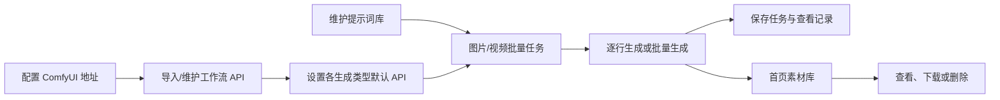

# 现有系统分析：AI绘视玩家ComfyUI管理系统

> 来源：用户实际页面检查（2026-08-05）
> 站点：`http://127.0.0.1:6799/web_comfyui_batch_operate/page/admin/index.html#/main`
> 定位：面向 ComfyUI 的批量图片/视频生成管理后台，页面标题"信息管理平台"，系统名称"AI绘视玩家ComfyUI管理系统"。
> 规模：4 组菜单、16 个功能页面 + 首页共 17 个页面。

## 一、总体菜单结构

```text
信息管理平台（AI绘视玩家ComfyUI管理系统）
├── 首界面（生成结果素材库）          #/main
├── 图片生成
│   ├── 文生图                        #/generate_image
│   ├── 单图生图                      #/singleImage2Image
│   ├── 双图生图                      #/twoImages2Image
│   ├── 三图生图                      #/threeImages2Image
│   └── 混合生图                      #/MulImages2Image
├── 视频生成
│   ├── 文生视频                      #/t2v
│   ├── 图生视频                      #/i2v
│   ├── 批量首尾帧                    #/start-end
│   ├── 视频参考                      #/referenceImageAndfVideo
│   └── 数字人                        #/digital_human
├── 任务管理
│   ├── 完成任务记录                  #/task_c
│   └── 操作记录                      #/task_a
└── 基础管理
    ├── 基础设置                      #/config
    ├── API 管理                      #/api
    ├── 提示词记录                    #/prompt
    └── 参考视频                      #/getImageFromVideo
```

结构特点：
- 一级菜单 5 项（首界面 + 4 个菜单组），二级菜单共 16 项，无三级菜单；
- "图片生成"与"视频生成"两组按生成类型平铺页面，每个类型一个独立路由；
- "基础管理"组集中了系统配置（基础设置）与数据管理（API/提示词/参考视频）两类功能；
- 所有页面均为免登录直接访问。

## 二、完整菜单与功能

### 1. 首界面 `#/main`
生成结果素材库：
- 卡片式展示已生成图片
- 单项：查看、下载、删除
- 批量：全选、清空选择、批量删除
- 点击加载更多
- 当前展示内容以提示词/任务名称作为图片标题

### 2. 图片生成
所有图片生成页通用能力：
- 全局提示词 1、全局提示词 2
- 设置默认宽度、高度、种子
- 随机种子
- 添加任务行
- 从本地文件导入任务，可指定起始行号、列号
- 导入时支持"添加现有队列"或"清空后添加"
- 单行生成、删除
- 批量生成；没有任务行时按钮禁用
- `SAVE`：输入任务名称后保存任务
- 搜索并选用提示词记录
- 搜索、更换生成 API
- 支持取消正在执行的任务

| 页面 | 路由 | 特有功能 |
|---|---|---|
| 文生图 | `#/generate_image` | 纯提示词生成；默认 720×1280；任务表含提示词、参数、预览图 |
| 单图生图 | `#/singleImage2Image` | 每行上传一张参考图；默认 480×720 |
| 双图生图 | `#/twoImages2Image` | 每行使用两张参考图进行融合生成 |
| 三图生图 | `#/threeImages2Image` | 每行使用三张参考图；表格含参考图、提示词、参数、预览 |
| 混合生图 | `#/MulImages2Image` | 混用文生图、单图、双图、三图任务；要求预先设置各类型默认 API；提供"设置API" |

### 3. 视频生成
视频生成页也具有全局提示词、种子、任务行、文件导入、逐行生成、批量生成、保存任务和更换 API 等能力。

| 页面 | 路由 | 特有功能 |
|---|---|---|
| 文生视频 | `#/t2v` | 提示词生成视频；宽高、时长、块交换、种子；默认 480×720、时长 2、块交换 0 |
| 图生视频 | `#/i2v` | 上传参考图后生成视频；其他参数与文生视频类似 |
| 批量首尾帧 | `#/start-end` | 每行设置首帧、尾帧和转场提示词；支持"导入任务" |
| 视频参考 | `#/referenceImageAndfVideo` | 同时提供参考图和参考视频；可设置帧数、块交换；默认 480×832、81 帧、块交换 30 |
| 数字人 | `#/digital_human` | 参考图、参考视频、音频 1/2、控制 1/2、提示词及生成设置，适用于单人/多人或对口型工作流 |

### 4. 任务管理
- 完成任务记录 `#/task_c`：按关键词查询；展示任务名称、任务类型、任务 ID；分页和记录操作
- 操作记录 `#/task_a`：按关键词查询；展示任务名称、任务类型、创建时间；分页和记录操作
- 检查时两个页面均无数据行，未能确认每行"操作"菜单的具体按钮

### 5. 基础管理
- 基础设置 `#/config`
  - 管理项目名称、ComfyUI 地址、WebSocket 地址、项目 IP
  - 当前 ComfyUI 地址 `http://127.0.0.1:8188`，WS 地址 `ws://127.0.0.1:8188/ws`
  - ComfyUI 地址和项目 IP 可修改；项目名称及 WebSocket 地址的修改按钮当前禁用
- API 管理 `#/api`
  - 按名称查询、按 API 分类筛选
  - 添加、修改、删除 API；设为默认或取消默认
  - 管理工作流输出节点编号
  - 分类：文生图、单图生图、双图生图、三图生图、文生视频、图生视频、首尾帧、视频参考、数字人
- 提示词记录 `#/prompt`
  - 按名称或内容查询、按分类筛选、分类管理
  - 添加、修改、删除提示词；字段：名称、提示词、分类、备注
  - 当前分类：国风、推文、玄幻、动漫、3D、科幻、解压、搞笑
- 参考视频 `#/getImageFromVideo`
  - 按名称查询、上传视频
  - 页面定义中存在确认、继续、取消等分阶段处理控件
  - 当前无已上传视频记录

## 三、站点工作流



## 四、检查中发现的产品问题
- 默认 1280px 浏览器宽度下，API 管理页右侧"添加API"按钮部分超出视口，存在横向布局溢出。
- 菜单名"任务管理"与页面面包屑"历史记录"术语不统一。
- 数字人页"时长"默认值 81 与视频参考页"帧数 81"单位/含义易混淆。
- 全局提示词视觉顺序是"提示词2"在前、"提示词1"在后。
- 大量操作只用 `SAVE`、图标或短名称，缺少中文说明和悬浮提示。
- 无登录拦截；若暴露到局域网，应增加身份验证及删除/API修改等操作的权限控制。
- 逐页检查未发现前端控制台错误。
